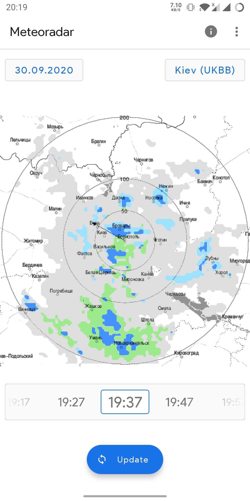
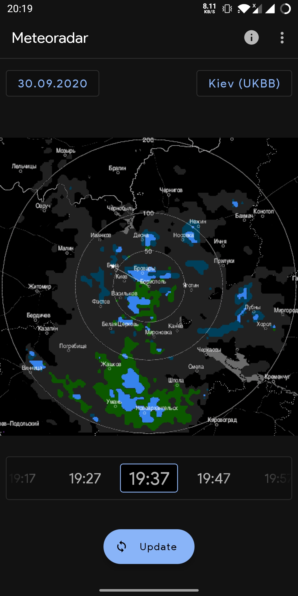

  

# MeteoradarAndroid

Light and fast app which is let you ability to see weather radar maps. 

Maps source: http://meteoinfo.by/

Supported Android >= 8.1 (API level 27)

## Features

- Light/Dark/System theme support
- Radar maps are supported for the following cities:
  - Kyiv
  - Minsk
  - Brest
  - Gomel
  - Smolensk
  - Bryansk
  - Kursk
  - Velikiye Luki
  - Zaporizhzhia
- Time selector
- Zoom radar map
- Map legend

## Screenshots

Light theme                                               |   Dark theme
:--------------------------------------------------------:|:----------------------------------------------:
  |  
